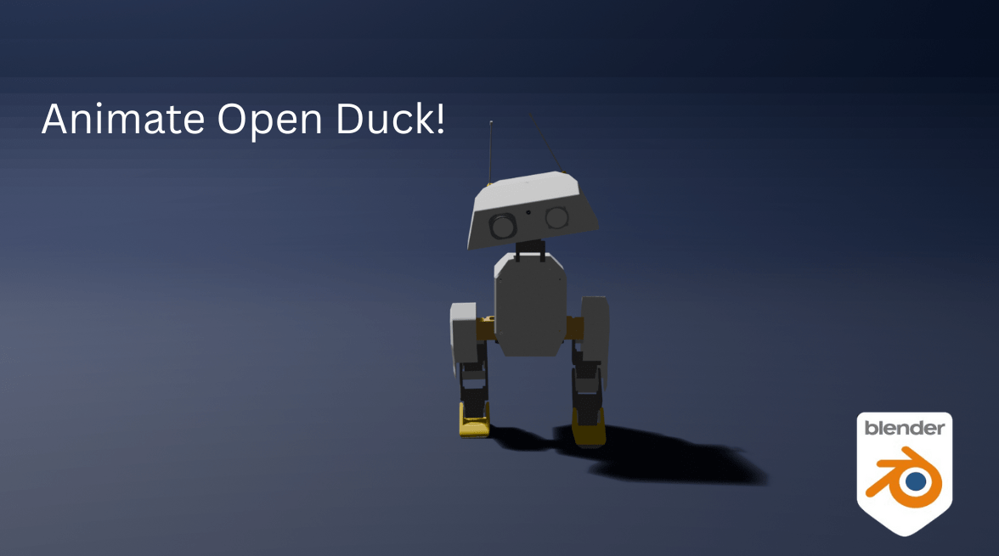
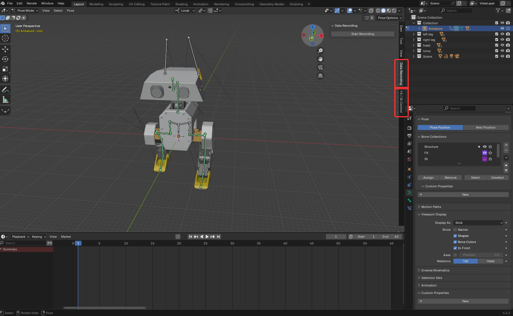
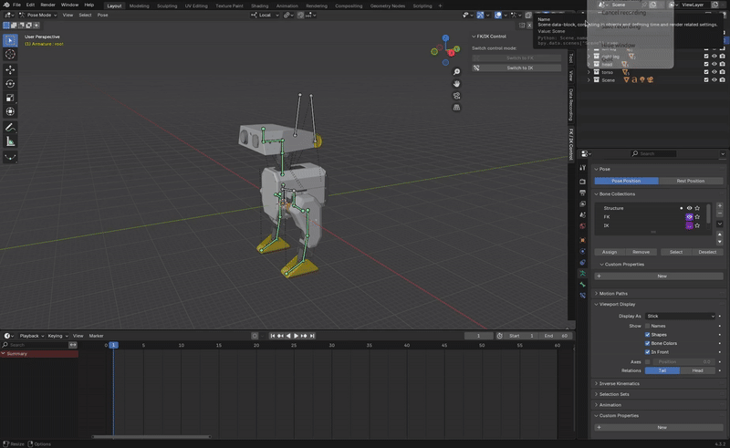
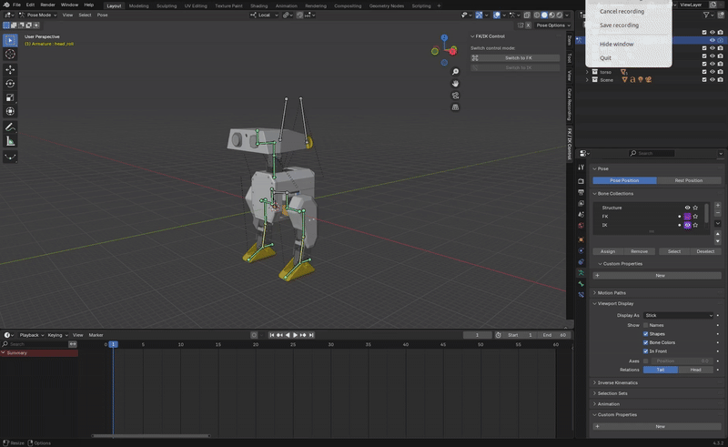
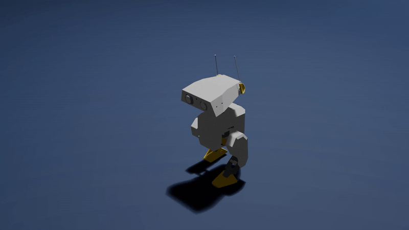

# 🦆 Open Duck Blender

<div align="center">



</div>

**Open Duck Blender** is a Blender rigging and animation environment for the small bipedal robot [**Mini Duck**](https://github.com/apirrone/Open_Duck_Mini), inspired by Disney’s BDX droid.

The project provides an FK/IK control system along with a reference data recording addon designed for training reinforcement learning policies.

---

## Requirements & Installation

### Tested Environment

- **Blender ≥ 4.3.2**
- OS: Ubuntu (tested under 22.04)

> Older Blender versions have not been tested but should work.

### Installation steps

1. **Clone the repository**  
   ```bash
   git clone https://github.com/pollen-robotics/Open_Duck_Blender
   cd Open_Duck_Blender
   ```
2. **Install git-lfs**
    ```bash
    git lfs install
    git lfs pull
    ```
3. **Open the Blender file**

Open `open-duck-mini.blend` in Blender.

> 💡 Both the FK/IK control addon and the data recording addon are preloaded and auto-enabled when you open the project.

<div align="center">



</div>

## Quick Start
1. Open open-duck-mini.blend in Blender 4.3.2+
2. The FK/IK control and Data Recorder tools are already enabled
3. Select the armature and enter Pose Mode
4. Use FK or IK bones to animate the legs. Head joints can also be controled, but only with FK for now
5. Develop your animation and use the panel to record and save joints data in the [desired format](https://github.com/apirrone/Open_Duck_reference_motion_generator/blob/11c3df93105d314c24702a2ea57e4bd103aea7c4/open_duck_reference_motion_generator/gait_generator.py#L291) for training

## Usage
### Animate with the Mini Duck rig

The Mini Duck rig includes two control systems for the legs, accessible with the **FK/IK Control** panel on the right:

- FK (Forward Kinematics): rotate each joint from top to bottom

<div align="center">



</div>

- IK (Inverse Kinematics): move the control bone and the rest follows. Changing the orientation of the control bone will change the orientation of the foot.

<div align="center">



</div>

> The first leg joint (*hip_yaw*) is controlled by FK and not IK.
GIF showing IK control

> Note that when switching from FK to IK, the foot orientation set in FK mode might not be preserved, this is a known current limitation of the IK system tha will be addressed in future updates.


You can switch between these control modes to create animations.

For now, the **head** can only be animated using FK.

### Snapping between FK and IK
<details>
<summary>❓ Why is snapping needed?</summary>
<br>
When animating in Blender, FK and IK cannot be used simultaneously on the same limb.
Switching between them without snapping causes the pose to jump or break.

The included control addon ensures a seamless transition between the two systems.
</details>

<br>

### Walk cycle example
A simple walk cycle is included in the project. You can find it in the timeline at frame 1 in Pose mode after selecting bones.

<div align="center">



</div>

## Recording Data for Reinforcement Learning
The data recorder addon automatically starts the recorded animation and logs joints data until the animation ends.

> 💡 Make sure that the animation is not running when pressing the *Start Recording* button

📁 Where is the data saved?

Recording is saved to *\<your Blender install directory>/duck_mini_data_records/* (the directory is created if it does not exist).

### Replay Recorded Data
You can replay the recorded with the script [ref_motion_viewer_episodic.py](https://github.com/apirrone/Open_Duck_Playground/blob/episodic/playground/open_duck_mini_v2/ref_motion_viewer_episodic.py) from Open_Duck_Playground (for now the replay is only available in the episodic branch).

```bash
# Install the Open Duck Playground repository
git clone https://github.com/apirrone/Open_Duck_Playground/tree/main
git checkout episodic
# Install uv
curl -LsSf https://astral.sh/uv/install.sh | sh
# Start the replay script
cd Open_Duck_Playground
uv run playground/open_duck_mini_v2/ref_motion_viewer_episodic.py --reference-data <path_to_your_recorded_data>
```

### Use recorded data to train RL policies
TODO